## About Charles 🤖🎶🥁📝

:::::::::::::: {.columns}
::: {.column width="60%"}
**Charles Martin**

- computer scientist, music technology researcher, performer
- postdoc at UiO 2016--2019 (EPEC Project)
- Senior Lecturer at Australian National University, School of Computing
- **researching** human-AI creative collaboration, including creating new ML models, new musical instruments, HCI and artistic research in musical collaboration
- **teaching** HCI, music computing, systems, creative coding, etc.
:::
::: {.column width="40%"}
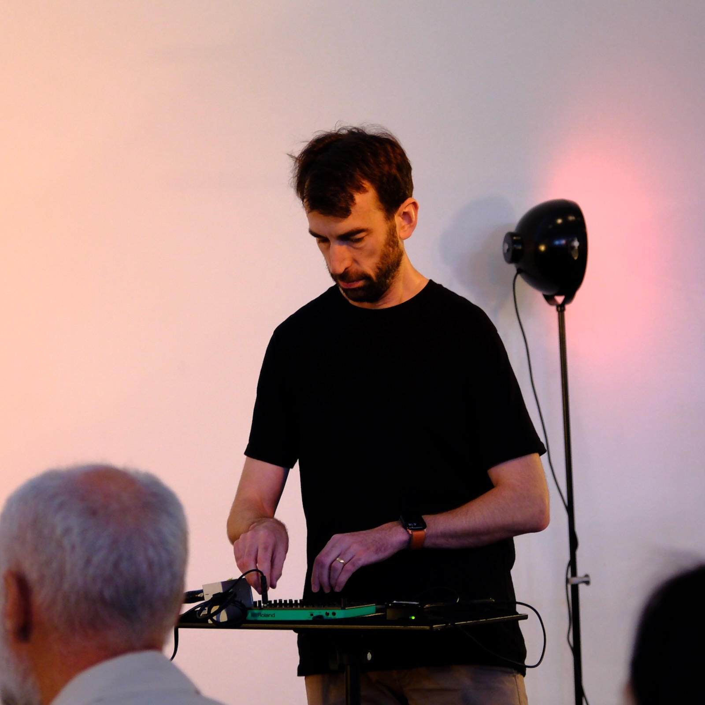
:::
::::::::::::::

# Why intelligent instruments?

## Generative AI is all over music, but mostly not in instruments

:::::::::::::: {.columns}
::: {.column width="60%"}

- We're aware of the threats and concerns about _AI generated music_.
- But few digital musical instruments integrate generative AI into *ordinary musical practice* [@jourdan_nime_ml_review]
- Many musical AI tools aren't artist-centred: hard to experiment with, embed, modify (exceptions: RAVE, Wekinator)

:::
::: {.column width="40%"}
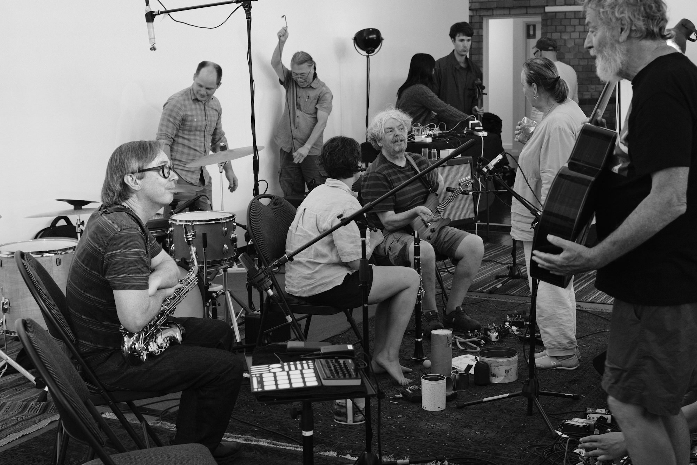
:::
::::::::::::::

<!-- _Exceptions:_ RAVE, IML system (?), Wekinator. -->
<!-- TODO links and cites for RAVE, iml, wekinator -->

**Question:** what does the design space for intelligent musical instruments look like when *accessible and portable* AI is available for artistic exploration?

<!-- Another question, can genAI be integrated into portable, electronic music setups? -->

:::notes
Hook: everyone is talking about generative AI music, but where are the instruments? Jourdan and Caramiaux identified gaps in interactivity and practice. As DL systems got more complex, artists got less contact with data and training. This talk is about closing that gap with cheap, portable hardware and small models.
:::

## What's an *intelligent* musical instrument?

:::::::::::::: {.columns}
::: {.column width="60%"}

- An instrument where an AI system **generates actions independently** of the musician's actions
- Includes Continuator [@Pachet:2003wd] and Voyager [@Lewis:2000fu]
- Excludes mapping-only systems like Wekinator [@fiebrink_meta-instrument_2009]
- This work takes a **small-data** approach [@Vigliensoni:2022]: artists collect, curate, train, and deploy their own AI

:::
::: {.column width="40%"}
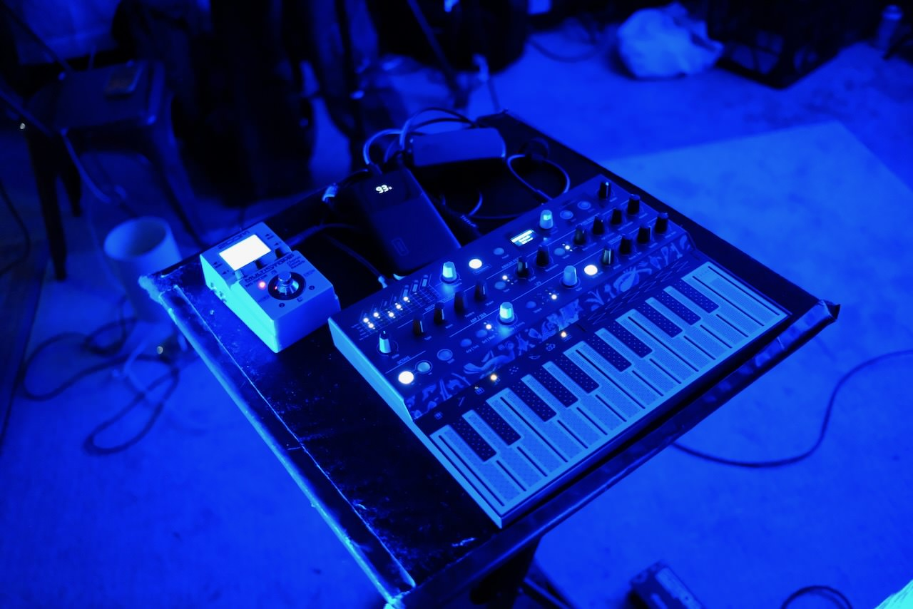
:::
::::::::::::::

**Q: Are RAVE systems intelligent?** A: I think it depends.

:::notes
The definition matters: AI acting independently, not just interpreting sensor data. And the small-data mindset is the ethical and practical counterpoint to industrial-scale AI. Everything in this project was trained on my own data on a normal laptop.
:::

# The platform: IMPSY

## Squeeze Generative AI into a MIDI Plug

:::::::::::::: {.columns}
::: {.column width="60%"}

- Python software + Raspberry Pi + custom OS image [@impsy_software_zenodo]
- Makes **no sound**
- listens and speaks MIDI (or OSC/WebSockets)

**Howto:** Flash an SD card, configure in a web browser, boots and play.

:::
::: {.column width="40%"}

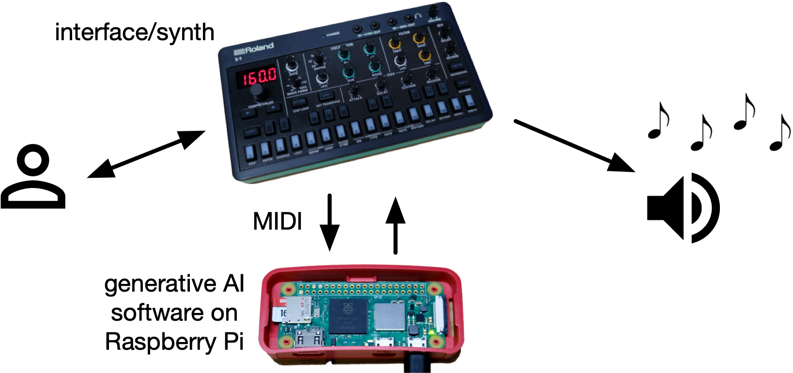

:::
::::::::::::::

:::notes
The platform is deliberately minimal: it doesn't produce audio, it controls other instruments. That's what lets it retrofit existing synths and DAWs. Pre-installed OS image means no Python wrangling for users, boot and go.
:::

## The AI model: small but musical

- Mixture density recurrent neural network (MDRNN) [@Martin2019]
- Generates tuples: 1–8 musical values **plus a time delta** (free rhythm, no grid)
- Typical model: 2 layers of 64 LSTM units. *Tiny* by genAI standards
- Trains in **under 30 minutes** on a normal laptop, from artist-collected data

## Cheap, small, battery-powered

::::::::::::::{.columns}

:::{.column width="55%"}

### IMPSY is light and fast

- Runs on any 64-bit Raspberry Pi, including the **Zero 2 W (15 USD)**, small enough to hide inside an instrument
- MIDI via USB interface, direct USB-MIDI, or two resistors on the UART pins
- Web interface for mappings, logged data, and model upload

<!-- TODO: new web interface screenshot. -->

:::

:::{.column width="45%"}

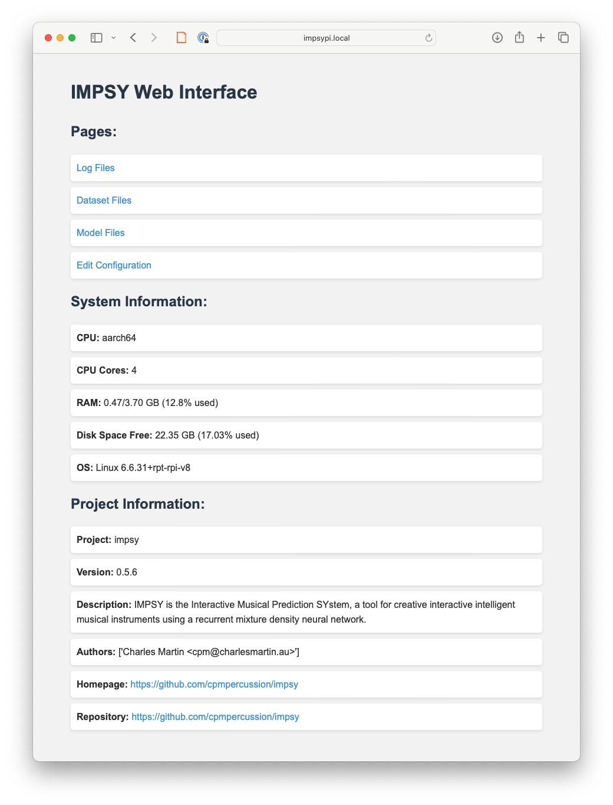

:::

::::::::::::::

## Fast enough for performance?

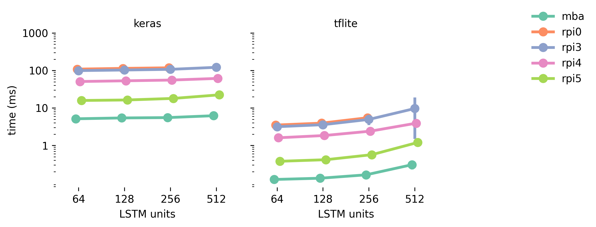{width=75%}

- Every Pi runs inference in **< 5 ms** (tflite); Pi 5 under 0.5 ms
- Critical to use embedded inference engine _tflite_ (now called _litert_).
- Boot-to-first-note: 114 s (Zero 2 W) down to 38 s (Pi 5)

:::notes
Quantitative testing isn't the focus, but the headline is: even the cheapest Pi is comfortably inside the 10ms benchmark from earlier work. Boot time turned out to matter more than inference time in practice, it shapes how you trust a system at a gig.
:::

# Two years, five instruments

## First-person artistic research

- Autobiographical design: instruments built for **my own performance practice** and tested in real gigs
- 15 performances and recordings (2024--2026); solo, duo, and group free improvisation
- Five intelligent instruments: **Volca, MicroFreak, S-1, DAW, Setup**
- Demo videos: <https://doi.org/10.5281/zenodo.19550146>

:::notes
Methods slide. keep it brief. First-person artistic research is the right first step for exposing design possibilities; broader artist-centred studies are future work. Mention the videos here so people can look them up.
:::

<!--
Instrument slides: each is a fullscreen background video with only the
instrument name over it. Drop the footage into video/ (see video/README.md)
using the filenames below, then `make reveal`. Until then the background is
just black. The former bullet content + image lives in each slide's :::notes.

background-video-loop / -muted keep the footage running silently behind the
name; background-size="cover" fills the frame.
-->

## The Intelligent Volca {.instrument background-video="video/1-intelligent-volca.mp4" background-video-loop="true" background-video-muted="true" background-size="cover"}

:::notes
Proof of concept — the rejected NIME 2024 demo. First experiment, fully self-contained and battery powered; the Volca even has its own speaker. The key realisation: the model, trained on expressive continuous control, might be better at smoothly varying synthesis parameters than at playing notes.

Slide points:
- Pi Zero, two resistors, UART MIDI, into a battery-powered Korg Volca FM
- AI controlled pitch and rhythm; I shaped the timbre
- One-way only. The Volca FM has no MIDI out
- Glissandi from a model trained on continuous gesture (a bit weird)
:::

## The Intelligent MicroFreak {.instrument background-video="video/2-intelligent-microfreak.mp4" background-video-loop="true" background-video-muted="true" background-size="cover"}

:::notes
First of the two-way, USB-MIDI synths. This is where it got musically interesting: the AI updates timbral parameters between phrases and even between notes, something I'd never do playing normally.

Slide points:
- USB-MIDI synths enable shared human–AI control: notes + seven timbral knobs
- Call-and-response: AI takes over when I stop… switch-over set to 0.1 s
- AI turns many knobs at once: inhuman but exciting exploration of a synth
:::

## The Intelligent S-1 {.instrument background-video="video/3-intelligent-s-1.mp4" background-video-loop="true" background-video-muted="true" background-size="cover"}

:::notes
Cranking the call-and-response switch-over down to 0.1 seconds was the pivotal move; it becomes interleaving rather than turn-taking. On the S-1 the tiny keyboard pushed me towards parameter play, letting the AI handle notes.

Slide points:
- Shared human–AI control over notes + seven timbral knobs
- Tiny keyboard nudged me toward parameter play, AI handling the notes
:::

## The Intelligent DAW {.instrument background-video="video/4-intelligent-daw.mp4" background-video-loop="true" background-video-muted="true" background-size="cover"}

:::notes
Remapping as design. DAWs are highly configurable on the MIDI side, so the combination is a fast design playground. The important experience: I could move AI signals to wherever they were musically useful and completely change the instrument's sound with the same trained model, untouched.

Slide points:
- AUM on iPad connected to the Pi over a cheap USB MIDI interface
- 8 channels in, 8 out, routed freely to software synths and effects
- Swap synths, remap signals, evolve the instrument without retraining
:::

## The Intelligent Setup {.instrument background-video="video/5-intelligent-setup.mp4" background-video-loop="true" background-video-muted="true" background-size="cover"}

:::notes
Multiple interfaces, one model. The mapping capability grew until the AI sat between multiple interfaces, each capable of input and output. The QuNeo setup finally felt like a comfortable, expressive instrument used in three festival performances with very different ensembles, from sparse acoustic textures to walls of noise. Visual feedback was what made the unruly instrument manageable.

Slide points:
- AI mediates between devices: S-1 + X-Touch Mini, then S-1 + QuNeo
- LED rings / touch strips = visual feedback on what the AI is doing
- Different control gestures = different ways to manage the unfolding AI process
:::

# Four design insights

## 1. (Re)mapping can replace retraining

:::::::::::::: {.columns}
::: {.column width="60%"}

- Changing how the model connects to controls and parameters opened new instruments *without touching the model*
- Retraining costs minutes to hours (or days for audio models); remapping is instant
- Focus AI on what a musician **cannot do**: turn five knobs at once, not play the melody

Remapping is sustainable and responsive design iteration.

:::
::: {.column width="40%"}

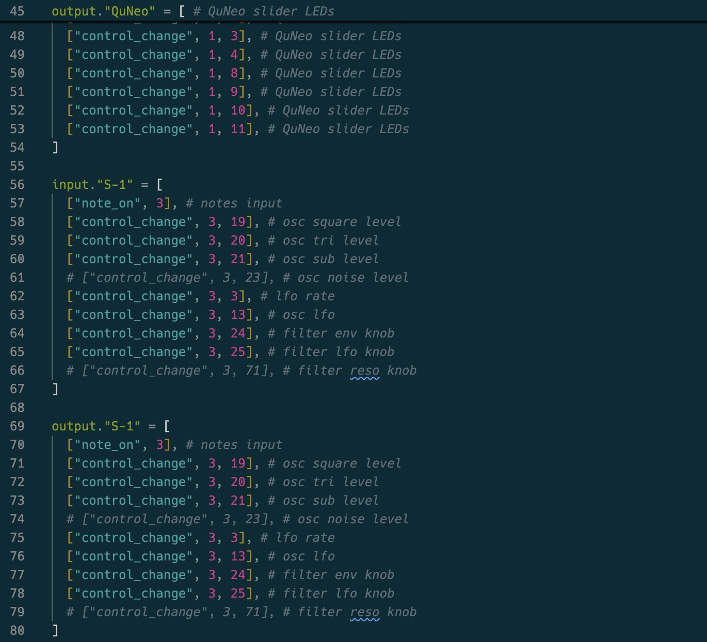

:::
::::::::::::::

## 2. Fast interleaving is a co-creative strategy

:::::::::::::: {.columns}
::: {.column width="60%"}

- 0.1 s switch-over between human and AI control: a new interaction approach
- Not a separate "agent"; more like a **free-running process** you guide but don't fully control
- Natural performance gestures instantly *rescue* the instrument from unwanted sounds [@stefansdottir_intelligent_2025]

**Musically productive and fun**

:::
::: {.column width="40%"}
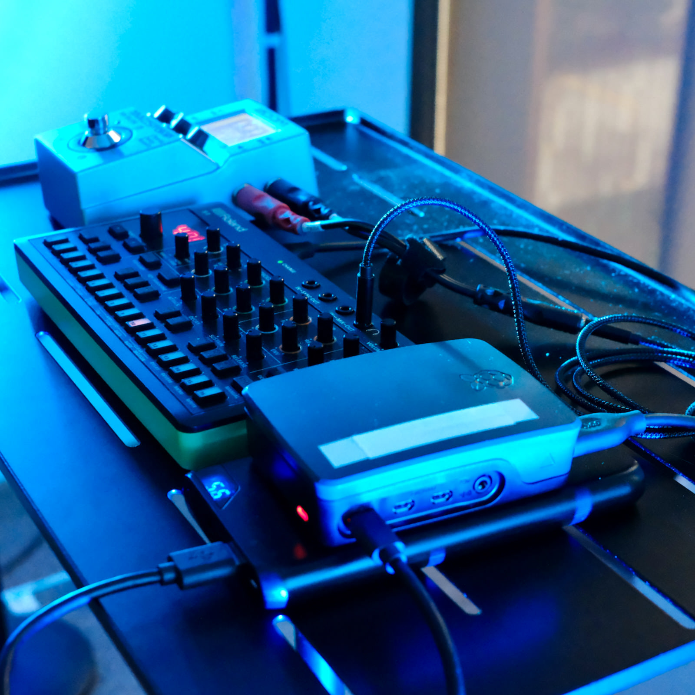
:::
::::::::::::::

## 3. Small-data models are transportable components

:::::::::::::: {.columns}
::: {.column width="60%"}

- **One model**, trained once on my own data, served all five instruments
- Like a trusted effects pedal: a design component you get to know over years
- Challenges the assumption that AI needs unethically sourced data and unsustainable compute

:::
::: {.column width="40%"}
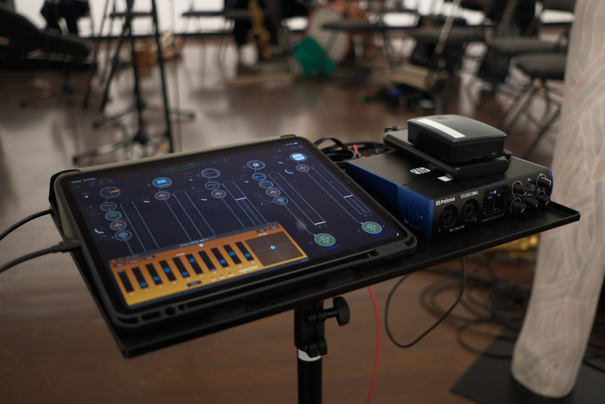
:::
::::::::::::::

## 4. Cheap hardware lowers barriers

:::::::::::::: {.columns}
::: {.column width="60%"}

- Works on a 15 USD computer: multiple Pis for group performances, loans, dedicated instruments
- MIDI lets you **retrofit existing instruments** rather than build new ones
- Inclusion *and* sustainability: reuse what musicians already own

:::
::: {.column width="40%"}

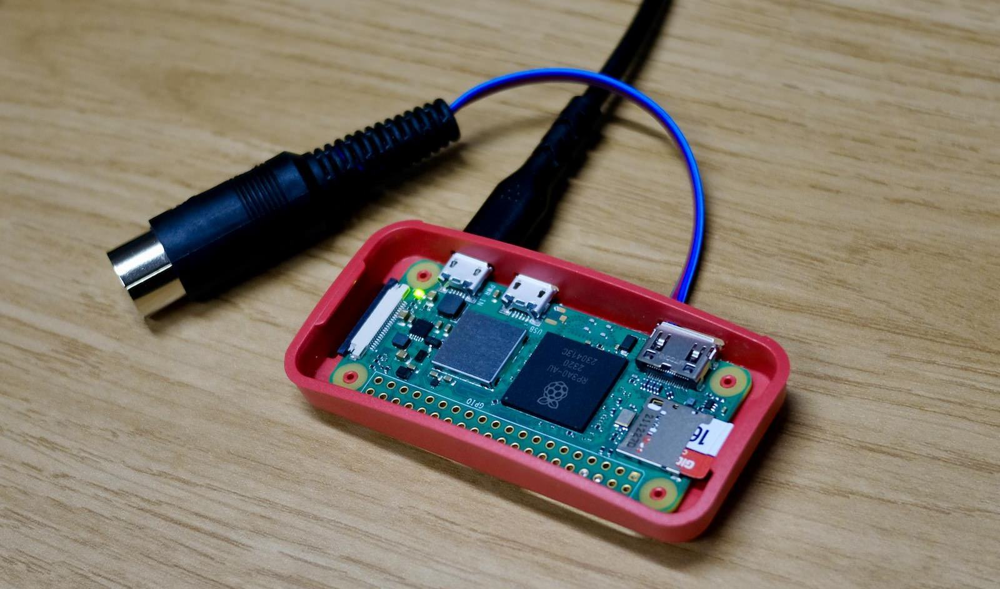

:::
::::::::::::::

## What's next? 

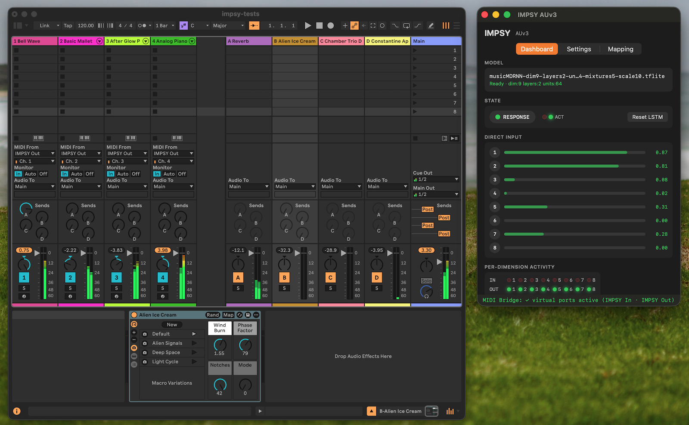{width=75%}

Make it an app! Stop using Raspberry Pis!

## Available Now from the Apple App Store

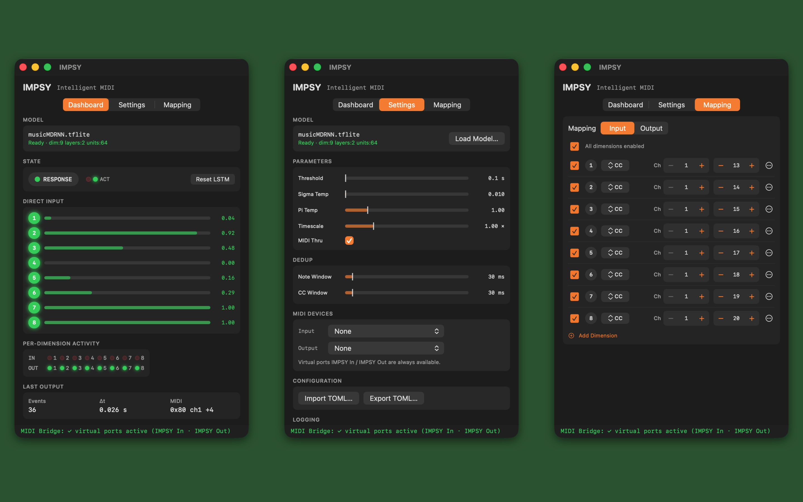{width=75%}

Available for MacOS and iOS. Host App with MIDI I/O, AUv3 midi fx unit.

## Conclusions

- A platform for prototyping intelligent musical instruments that is cheap, small, and artist-centred
- Five instruments, 15 performances, two years of practice
- The design space is **still opening**: remapping, interleaving, transportable models, accessible hardware
- Next: model evolution over time, and co-design with other artists

## Thanks!

::: {.questions}
**Questions?**

- Software: <https://github.com/cpmpercussion/impsy>
- Videos: <https://doi.org/10.5281/zenodo.19550146>
- charles.martin@anu.edu.au
:::

## References
